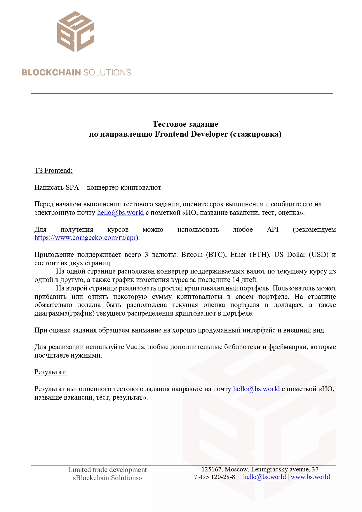

# vue_task_crypto_converter

## Project setup

```
npm install
```

### Compiles and hot-reloads for development

```
npm run serve
```

### Compiles and minifies for production

```
npm run build
```

### Lints and fixes files

```
npm run lint
```

<!--  -->
<div align ="center">
  
</div>
